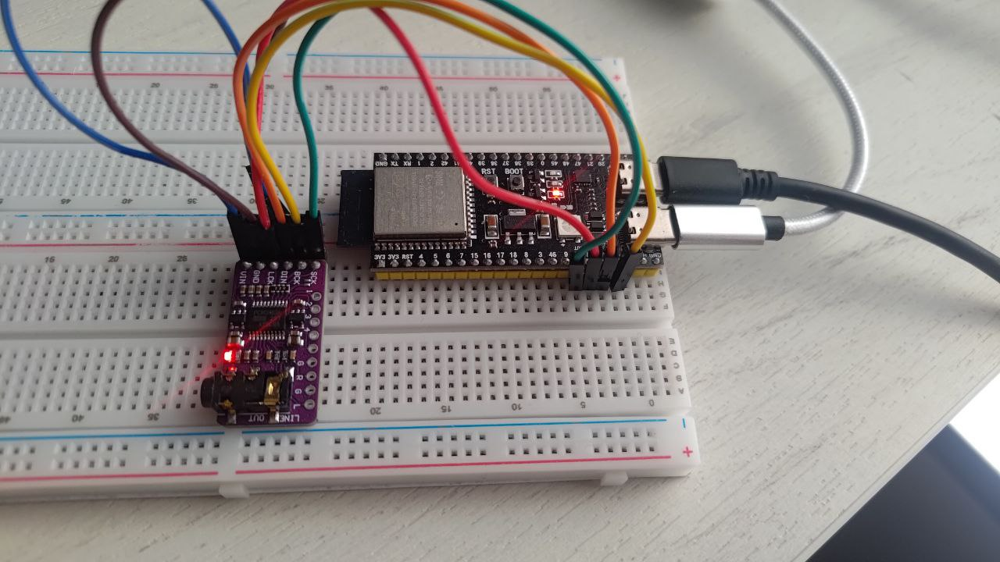

# ~~ESP32-S3 synth using ESP-IDF~~

# Project failed

I was trying to make CLAP-compatible host on ESP32-S3. After implemening host i stumbled on really bad stuttering issues with simple CLAP synth.

As complete newbie to MCU i didnt knew that i need proper FPU with double precision for that. And it is widely used in the synth headers.

ESP32-S3 suppors only single-precision math, excluding division, that makes that hardware not suitable for being CLAP-host.

That is the reason why Teensy was widely used for project like that. I'll move to STM32H7 hardware with that code.

Sadly there's no CLAP-like api for fixed point synths, that would be great.

-----


I was trying to make synth with Arduino with ESP32-S3 and after messing with it for some time i came to conclusion.

1) Arduino USBHost feature suck because [Espressif "forgot" to implement that feature in Arduino](https://github.com/espressif/arduino-esp32/issues/10978). There's [external library and it uses base ESP-IDF library for USBMidi host](https://github.com/enudenki/esp32-usb-host-midi-library.git). 
2) When i started to wire midi to some basic oscillator i came to realisation i need to learn FreeRTOS to make sound not crackling and MIDI being as low-latency as possible.
3) ESP32-S3 is multicore board.

So i came to conclusion - I need to use bare FreeRTOS, or in that case - ESP-IDF which is variant of FreeRTOS.

Background - I am JS developer for shit ton of years and have experience in Go. I didn't knew either C or C++ at the start of that project.

## What do i want from synth

- I want Clonewheel organ with leslie, distortion and spring reverb with MIDI configuration. I want parameters to be simple and for now i feel that tuning of stuff should be done in header files, and not through midi. I want ONE good sound. There's enough clonewheel organs out there with sources, even for ESP32.
- Rhodes synth with distortion, tremolo and spring reverb. There's MDA ePiano port, and there's numerous modelling tutorials.
- Clavinet - i have no idea yet how will i model this, i havent found modelling tutorial
- Simple synth alike OBXD or tal noiseMaker

## Board



Its just ESP32-S3 dev board with two USB-C connectors and PCM5102A. if board just had DAC on itit would be just one board, heh.

During Arduino tests i confirmed that this setup is sufficient for my purposes.

Overall cost without wires and breadboard - 9$.

## Steps

### Finding good board for synth - ✔ 

ESP32-S3 has USB-OTG host on board so i can potentially use that for USBMIDI

### Wiring sound in - ✔

I am using I2S bus with PCM5102A. It was making sound with Arduino and now it makes sound with bare ESP-IDF.

### Make USBMIDI work - ✔

Somehow i managed to port https://github.com/enudenki/esp32-usb-host-midi-library.git from C++ to C and wire it in.

### Learning C - ✔

I've read C Primer Plus and i have idea what to C code does now. I did read beej book also. I think i'll need some more books like ModernC but i'll stop for now.

### Reading how to use DMA buffers for sound, whats buffers etc - ✔

It seems that's the main idea how that would work, i'll sythesize some sound based on current midi state and time state, write some data ahead, then process midi after that in 1000HZ tick time. 

My vague naive idea that there would be some byte buffer or even two of them that i will fill and somehow pass to DMA I2s async write method.

If that's true - i need to make it abstract enough so i can use any DSP library, so i wont write my own oscillators, mixers, revebs from scratch. 

#### What do i know

```i2s_channel_write``` that i use is blocking function for sure, but if i have audio data equal to DMA buffer, then i will have my audio.

For now i will accept that MIDI data will be read after writing to i2s_channel_write. [There's some documentation in here of non-blocking variant](https://docs.espressif.com/projects/esp-idf/en/latest/esp32s3/api-reference/peripherals/i2s.html#how-to-prevent-data-lost) and in case of bad cracking or other problems i will use callback interface, but i feel that using blocking function MIGHT be fine.

#### Subgoals

##### Get the calculation of DMA buffer for sound and match it somehow to time domain - ✔
[Some calculations are there](https://docs.espressif.com/projects/esp-idf/en/latest/esp32s3/api-reference/peripherals/i2s.html#how-to-prevent-data-lost)

Its in audio.h

##### Lookup how time domain is matched to another SDK like LADSPA or Clap - ✔

With CLAP SDK - by frames

##### Implement bridge of CLAP float* array of sound into I2S DMA Buffer - ✔

Still no idea about Filling DMA buffer. Somehow PCM format looks the same between CLAP and I2S.

[Good example](https://github.com/infrasonicaudio/esp32-i2s-synth-example/blob/main/main/i2s_example_main.c)

As it turned out synth pcm output is float and i2s input is int32. So we need "float unpacking" or "saturation cast"

I used ChatGPT to figure that out

```
bufferToUse[2 * i] = (int32_t)(left[i] * 2147483647.0f);
```

This is enough to get right sound from buffer filled with floats by clap into I2S.

[cpp built in cast method](https://en.cppreference.com/w/cpp/numeric/saturate_cast.html)

### Write funny article about how i stuggled with stupid thigs with I2S - ✖

Writing intensifies.

### ~~Wiring MIDI to Sound - ✖~~

~~I did that with Arduino, mapped midi keyboard event to frequency, copypasted simple oscillator and made primitive square-wave monophonic synth with simpliest volume envelope ever. BUT the sound was interrupted by midi reading procedure, so either i had really long reaction time to key press, or i had sound crackling~~

I will use CLAP SDK, will wrap current USBMIDI events into clap events.

### Write USBMIDI -> CLAP events code - ✔

Not that hard. Good example of writing linked list with memory free.

### ~~Writing document with idea about simple HAL or even struct\data pipeline for realtime synth  - ✖~~

~~That should be documented, it is kinda universal for all synth engines. Maybe even someone has tutorial about that.~~

I will use CLAP SDK.

### ~~Wiring in polyphonic synth with simple volume\filter envelopes that is controllable by midi - ✖~~

~~I want to use external DSP libraries for oscillators, mixers and filters first so i dont need to learn DSP at first while doing overall synth layout. I need simple synth working first.~~

~~I will use most of FreeRTOS there for resourse management.~~

I took simple CLAP plugin written in C and i will integrate it into the board by implementing CLAP-like host. As outcome i will have CLAP plugin that i can build into the controller AND on PC so i will develop stuff on PC.

### Run simple CLAP plugin without modifications - ✔

I am using CLAP plugin that is built on pc. It works on hardware now.

### Fix sound craclking - ✖/✔

I2s, blocking etc etc. I need to set timeout 1ms MORE than sound itself. WHY?

~~also i implemented double buffering so i can use two cores.~~

~~Probably need ring buffer and generate sound in it and read data from callback, filling on fly?~~

~~I used xStreamBuffer and it works like needed, buffer is twice size of buffer, synth tries to fill 1.5 times of buffer every tick OR remaining space. I2S tries to flush 1 buffer. Still Cracking but far less.~~

~~I wanna do last step and use callbacks.~~

Giving up for now.

### Learning how DSP works - ✖

When i will do simple good synth, i will move to the more processing\modeling stuff i wanted.

PS: I am already struggling with some parts of DSP. Saturation clamp was not fun to epxlore.

### Read some C threads book and FreeRTOS one - ✖


### Serial MIDI - ✖

This is not hard step to make, but i will push it way after synth itself.

### Screen and MIDI learn - ✖

After i do at least one good synth engine, i'll start doing MIDI learn setup using some simple button interface and screen.

### Control Surface  - ✖

I have Novation Launchkey mk3 and i will like to use its screen instead of I2c screen i'd have on. Also Launchkey is prety slick when coming to emulating switches with pads.